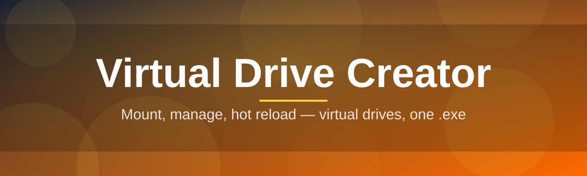

# virtual-drive-configurator 💽⚙️

  

*Mount, shape, and vanish drives on command — no wizard, no reboot, no drama.*

  

## 🧭 Overview

**virtual-drive-configurator** is a standalone Windows utility for spinning up virtual drives on demand. Point it at a folder, an ISO, or raw allocated space, and it hands back a fully addressable drive letter your OS treats like real hardware. No partitioning tools, no BIOS dives, no third-party disk suites bloated with telemetry you didn't ask for.

Virtual drives solve a boring problem in an elegant way: isolate a workload, sandbox a test environment, mount an image without burning it, or carve out a scratch disk that disappears the moment you close the app. Developers use it to test installers against clean volumes. Archivists use it to mount disk images without commitment. Privacy-minded users use it to keep sensitive data off the physical disk entirely, living only in a session that ends when the app does.

This tool exists because Windows' native disk management is built for permanence — partitions, formatting, drive letters that stick around forever. Sometimes you just want a drive for the next twenty minutes. **virtual-drive-configurator** is built around that exact use case: fast creation, fast teardown, zero residue.

> [!NOTE]
> The link above goes to the project landing page. That's where the current build lives, always.

---

## 🔩 What It Actually Does

- **Instant Drive Spawning** — request a virtual volume, get a live drive letter in seconds, backed by disk image, memory, or folder redirection.

- **Session-Bound Volumes** — spin up a drive that exists only for the current session and unmounts clean on exit, leaving nothing behind on the physical disk.

- **ISO & Image Mounting** — load `.iso`, `.img`, or `.vhd` containers directly as navigable drives without extraction or burning.

- **Custom Size & Filesystem Control** — dial in exact capacity and pick your filesystem (NTFS, FAT32, exFAT) per virtual drive.

- **Drive Letter Management** — assign, reassign, or lock specific letters so scripts and shortcuts never break between sessions.

- **Read-Only Lockdown Mode** — flip any mounted drive to read-only for safe inspection of sensitive or untrusted images.

- **Batch Profile Configs** — save a drive's full spec (size, letter, filesystem, source) as a profile and re-mount it in one click next time.

- **Zero-Footprint Cleanup** — a single "eject all" action tears down every virtual drive the app created, restoring your system to its pre-launch state.

---

## 🚀 Getting Off The Ground

> [!TIP]
> This is a standalone executable. There is no installer to babysit and no setup wizard to click through.

1. Visit the landing page using the download button above.

2. Grab the latest build for your Windows version.

3. Run the executable — no install step, no admin prompt unless mounting requires elevated disk access.

4. Configure your first virtual drive from the main panel and mount it.

---

## 🖥️ System Requirements

| Requirement | Detail |
|---|---|
| OS | Windows 10 or Windows 11 (64-bit) |
| Dependencies | None — fully self-contained |
| Disk | Space equal to your largest planned virtual drive |
| Admin rights | Only required for certain low-level mount operations |
| Internet | Not required after download |

  

---

## 🧠 How It Works

The app sits between your request and the Windows disk subsystem, translating a simple config into a live, addressable volume.

1. You define a drive spec — size, source, filesystem, letter.

2. The engine allocates the backing store (image, memory block, or folder).

3. Windows' mount APIs bind that store to a drive letter.

4. The volume appears in Explorer like any physical disk.

5. On eject, the binding is torn down and the letter is released.

> [!IMPORTANT]
> Ejecting a drive discards any unsaved session data if the backing store was memory-based. Disk-image-backed drives persist normally.

---

## 🛟 Troubleshooting

<strong>My virtual drive doesn't show up in File Explorer.</strong>

Refresh Explorer or check "This PC" manually — some drive letters take a moment to register in the shell namespace after mount.

<strong>Mounting an ISO fails silently.</strong>

Confirm the image isn't already mounted by another tool. Windows only allows one active mount per image file at a time.

<strong>The app asks for administrator rights — is that normal?</strong>

Yes, for certain mount types that require kernel-level disk driver access. Standard folder-backed drives usually don't need elevation.

<strong>My drive letter conflicts with an existing one.</strong>

Use the Drive Letter Management panel to pick an unused letter, or let the app auto-assign the next free one.

<strong>Can I resize a virtual drive after creating it?</strong>

Not while mounted. Eject first, adjust the size in the profile, then remount.

<strong>The app closed and my virtual drive vanished with data on it.</strong>

That's expected for memory-backed or session-bound drives. Use a disk-image-backed profile if you need persistence across restarts.

---

## 🎨 UI / UX Details

- **Themes** — Light, Dark, and a high-contrast mode for low-light setups.

- **Keyboard Shortcuts**:

  | Action | Shortcut |
  |---|---|
  | New drive | `Ctrl + N` |
  | Mount selected profile | `Ctrl + M` |
  | Eject all drives | `Ctrl + Shift + E` |
  | Toggle read-only | `Ctrl + R` |
  | Open settings | `Ctrl + ,` |

- **Settings persistence** — profiles and preferences save locally, no cloud sync, no accounts.

- **Compact mode** — collapse the panel into a minimal tray-friendly window for background use.

> [!WARNING]
> Closing the app while "Eject on exit" is disabled leaves drives mounted until next reboot or manual eject.

---

## 🤝 Contributing & Community

Bug reports, feature requests, and pull requests are welcome. This is a solo-maintained project moving fast — clear, reproducible issues get fixed quickest.

> Found an edge case with a weird filesystem or image format? Open an issue with steps to reproduce. That's the fastest path to a fix.

- Keep pull requests focused — one change, one purpose.

- Discuss larger features in an issue before building them.

- Be direct. This project has no patience for bikeshedding.

---

## 📄 License

Released under the [MIT License](LICENSE), 2026.

---

## ⚠️ Disclaimer

This tool creates and manages virtual drives at the operating system level. Always verify mounted image sources before use, and back up important data before experimenting with disk-image-backed profiles. The maintainer is not responsible for data loss resulting from misconfiguration or misuse.

